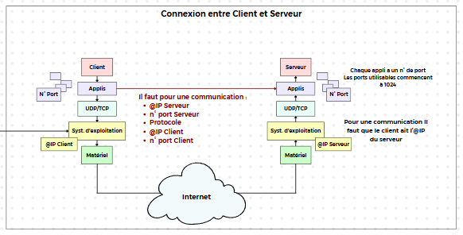
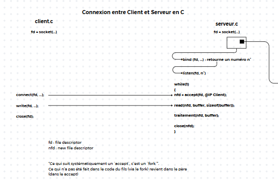
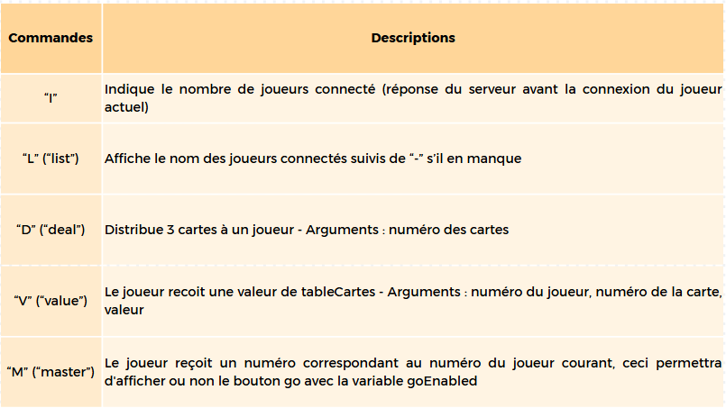
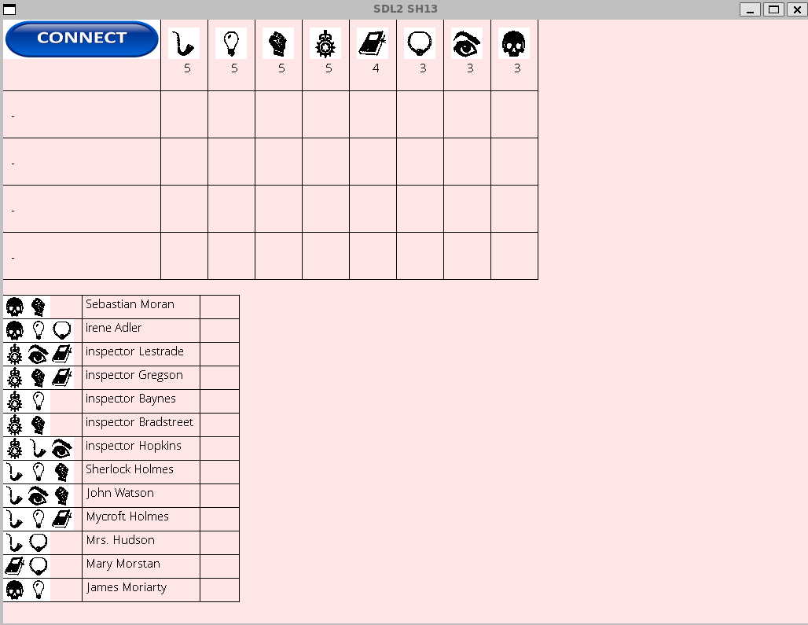
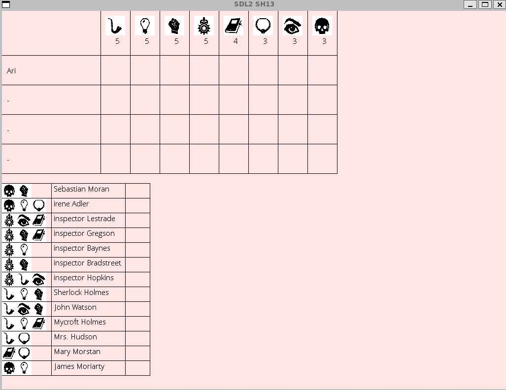
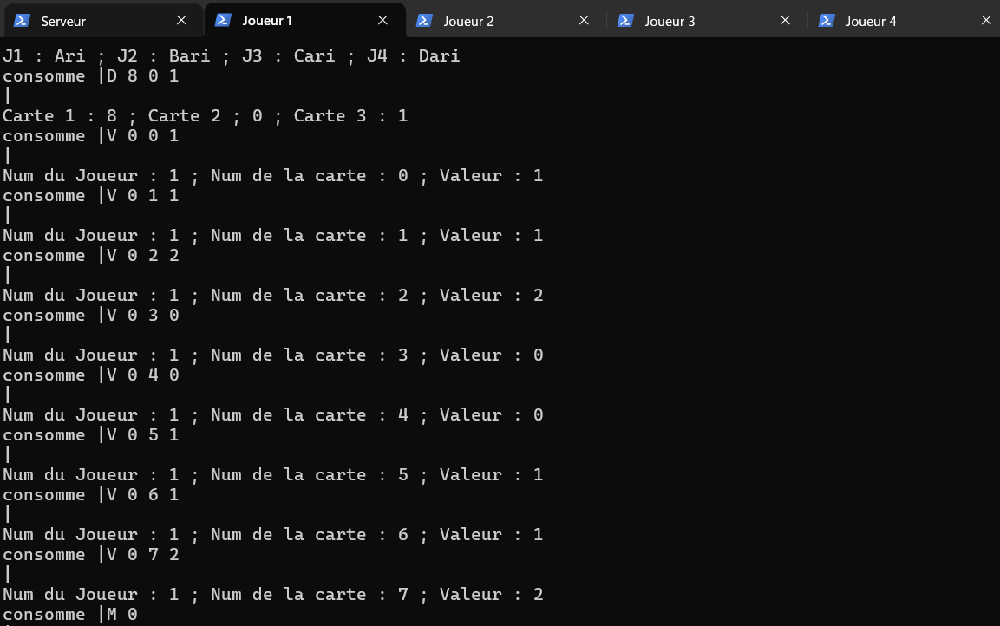
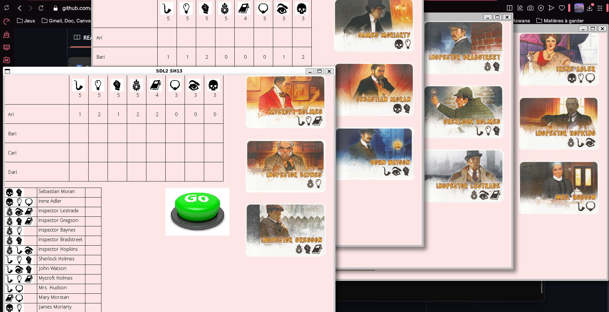
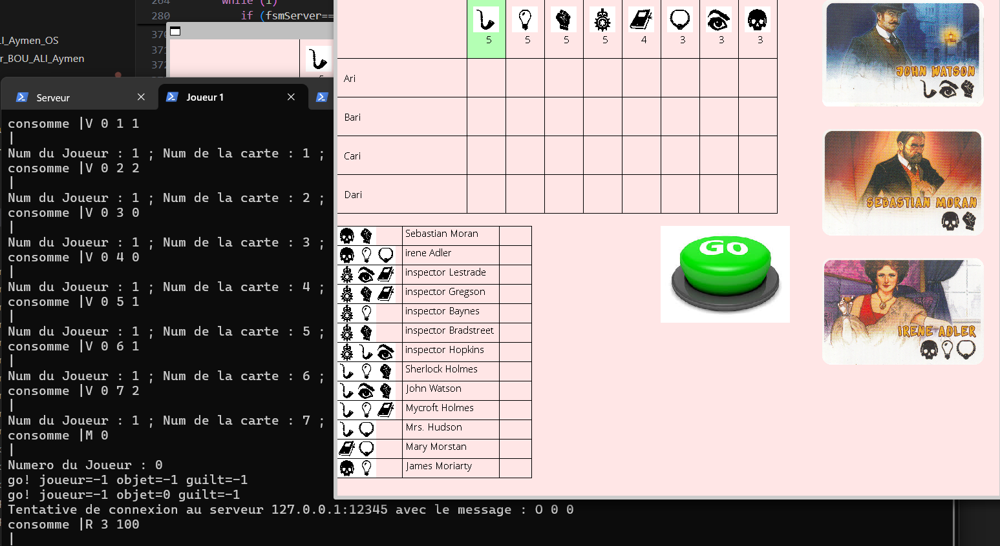
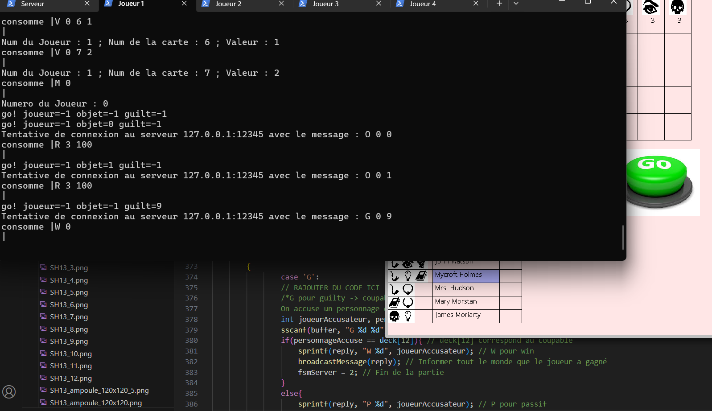

# Projet Sherlock13 et Travaux Pratiques Systèmes Utilisateurs

## Introduction
Ce projet regroupe les concepts abordés lors des Travaux Pratiques (TP1, TP2, TP3) et la réalisation du jeu multijoueur **Sherlock13**. Le projet met en œuvre des notions avancées de programmation système, telles que la gestion des processus, la communication réseau, les threads, et la synchronisation.

---

## Contenu des Travaux Pratiques

### **TP1 : Création de Processus**
**1 - Quels sont les paramètres de fork ?**

L'appel système fork n'a besoin d'aucun paramètre pour être éxécuté. pid_t fork(void);


**2 - Que contient la valeur de retour de fork ?**

fork retourne en soi deux valeurs, une chez le parent qui comprend le PID* de l'enfant lui-même différent du PID du parent et fork retourne aussi 0 chez l'enfant.
Si une erreur survient, fork retourne une valeur négative et ne crée pas d'enfant.

*PID : Process ID


**3 - Expliquer pourquoi l’appel système fork rend DEUX valeurs de retour.**

Le PID de l'enfant et du parent ne doivent pas être les mêmes. En effet, cela causera des problèmes dans la table des processus si cela à être le cas. Pour cela, fork donne à l'enfant une valeur, et donne également une valeur de retour au parent avec le PID de l'enfant.


**4 - En prenant l’exemple d’une application USER qui débute son tick système (donc il lui reste beaucoup de temps pour faire des choses) et qui fait un appel système fork, expliquer en détail ce qui se passe dans le système.**

De façon simple, plusieurs fonctions existent pour connaître certaines informations de la table des processus :

Qui permet d'obtenir le PID du processus en cours d'éxécution :
```bash
getpid()
```

Bloque le processus parent jusqu'à que le processus enfant change d'état via la mort du processus enfant avec exit(0) :
```bash
waitpid(PID_Enfant, &statut, option)
```

Tue le processus enfant mais ne le supprime pas de la mémoire. On peut retrouver son "cadavre" (haha...) en bloquant le processus parent et en faisant "ps -a" dans le terminal :
```bash
exit(0)
```

Nettoie le "cadavre" de l'enfant :
```bash
kill(PID_Enfant, SIGTERM)
```

Permet de charger un nouveau programme en mémoire et remplace le processus en cours par le programme chargé :
```bash
execve(const char *pathname, char *const argv[], char *const envp[])
```

Renvoie 0 si un processus enfant est créé. Renvoie une autre valeur positive s'il n'y a que le processus parent. Renvoie une valer négative si une erreur survient :
```bash
fork()
```

#### Pour la suite des explications du TP1, on se placera dans le dossier TP1 afin de mieux comprendre les fichiers fork*.

Lorsqu'on lance fork1, on observe deux valeurs sans forcément comprendre la différence entre les deux même si la réponse est plutôt simple. En réalité, lorsqu'on lance l'appel système fork, un processus enfant est créé et exécute le code en lui-même. En même temps, le processus parent fait son exécution du code.

Cette distinction est claire dans fork2.c

Par contre, dans fork3.c, le processus parent est bloqué avec le scanf tant que l'utilisateur ne rentre pas de valeur. Pendant ce temps là, le processus enfant exécute le programme en rentrant dans la condition (p == 0) et meurt. Comme le scanf est encore en cours d'exécution, le parent ne peut pas finir le travail de nettoyer le cadavre de l'enfant (c'est horrible de dire ça).
On peut donc via la commande "ps -a" dans un terminal, voir le corps inerte de l'enfant au sol (ajout de "defunct" devant le nom du processus).


#### Création de processus avec minishell

La fonction mini1.c permet de sauvegarder la commande entrer par l'utilisateur. Evidemment, la commande n'est ici pas exécutée, ce qui n'est pas le cas dans mini2.c.

fd signifie file description.

---

### **TP2 : Communication Client-Serveur**
Dans ce TP, nous avons abordé plusieurs notions comme les sockets pour la communication réseau mais aussi comment implémenter un serveur TCP et un client TCP. Pour mieux visualiser le tout, voici deux schémas liés entre eux.




*Ne faites pas attention à la taille je savais pas comment placer les images mais au moins il y a une petite flèche qui indique le sens de parcours...*

Dans la deuxième image, il faut comprendre que les commandes se font dans un certain ordre en commençant par le haut, c'est donc le serveur qui va initier la connexion en attendant via un listen la connexion d'un client (accept).

La notion de port et la notion d'IP sont aussi très importantes dans la communication réseau, voici quelques commandes que vous pouvez exécuter depuis le dossier TP2 :

**Commandes pour exécuter :**
Compilation du serveur :
```bash
gcc server.c -o serveur
```
Lancement du serveur :
```bash
./serveur 32000
```
Compilation du client :
```bash
gcc client.c -o client
```
Lancement du client :
```bash
./client <adresse_IP> 32000 <message>
```
Pour connaître l'adresse IP de la machine :
```bash
ip a
```

---

### **TP3 : Threads, Mutex et Variables de Condition**
Dans ce TP, nous avons pu aborder les notions de création et de gestion des threads mais aussi la synchronisation des threads. Les fichiers sont disponibles dans le dossier TP3 puis dans le dossier threads.

#### Qu'est-ce qu'un thread ?

Pour faire simple, un thread est une sorte de programme. Un thread peut communiquer avec d'autres threads et ce qui rend les threads très forts c'est leur capacité à être "mis en pause". Par mettre en pause je pense au fait qu'on puisse donner un nombre de cycle machine maximal à un thread pour exécuter les commandes qu'il doit exécuter et si ce cycle arrive à sa fin il passe le relais.

#### Thread 1 :

On peut voir que les clients prennent dans le stock sans qu'il n'y ait de protection de la donnée stock.
Création et gestion de threads avec `pthread_create`.

#### Thread 2 :

On met des mutex (lock et unlock) pour que l'ordre soit respecté.


#### Thread 3 :

Sections critiques créées :
```bash
pthread_mutex_lock (& store.mutex_stock);
pthread_mutex_unlock (& store.mutex_stock);
```

Thread créés
Varaibles de condition créées :

```bash
pthread_cond_t cond_stock;
pthread_cond_t cond_clients;
```

Cette fonction ne fonctionne qu'après un lock, on est dans la section critique et on a la condition qu'on voulait.
Sinon si la varaible de condition n'est pas vraie, on s'endort en libérant le lock :
```bash
pthread_cond_wait (& store.cond_stock, & store.mutex_stock);
```

Cette fonction signale la condition. Elle permet de prévenir tous les clients qu'il y a du stock :
```bash
pthread_cond_signal (& store.cond_clients);
```

Ici, le client prévient le store qu'il a récup du stock afin que celui-ci sache s'il doive remplir ou non le stock :
```bash
if (val > store.stock)
      {
         pthread_cond_signal (& store.cond_stock);
         pthread_cond_wait (& store.cond_clients, & store.mutex_stock);
      }
```


Dans affinity.c, on fixe les affinités en fonction des thread et des processeurs disponibles. Cette commande donne le nombre de processeurs :
```bash
int numberOfProcessors = sysconf(_SC_NPROCESSORS_ONLN);
```

#### Dans sh13.c :
Volatile permet de ne pas accéder à la valeur qu'il y a dans le cache mais à la vraie valeur, la vraie adresse :
```bash
volatile int synchro;
```

---

## Projet Sherlock13

### **Description**
Le projet **Sherlock13** est un jeu multijoueur basé sur un serveur et des clients. Le serveur gère la logique du jeu, distribue les cartes et synchronise les actions des joueurs. Les clients interagissent avec le serveur pour effectuer des actions comme accuser un personnage ou demander des informations.

### **Fichiers principaux**
- **`server.c`** : server.c implémente le serveur du jeu, gère les connexions des joueurs, distribue les cartes et synchronise les actions durant la partie.
- **`sh13.c`** : sh13.c implémente le client du jeu, permettant aux joueurs d'interagir avec le serveur.
- **`Makefile`** : Le makefile permet la compilation des deux fichiers d'une manière séparée.

---

### **Description des commandes**

Voici un tableau récapitulant les commandes possibles :



---

## Compilation et Exécution du Projet Sherlock13

### **Étapes pour lancer le projet**

1. **Compilation avec Makefile :**
Dans le répertoire contenant les fichiers `server.c`, `sh13.c` et le `Makefile`, celui de départ, exécutez :
```bash
make
```

2. **Lancement du serveur :**
Ouvrez une première fenêtre de terminal et exécutez :
```bash
./server 12345
```
N'hésitez pas à renommer vos fenêtres pour que le lancement soit plus simple ! (Ex. : Serveur, Joueur 1, Joueur 2, ...)


3. **Lancement des joueurs :
Ouvrez quatre autres fenêtres de terminal et exécutez les commandes suivantes pour chaque joueur :
*Joueur1*
```bash
./sh13 127.0.0.1 12345 127.0.0.1 12341 Ari
```
Vous devriez avoir une fenêtre qui s'ouvre avec l'apparence suivant :



Puis appuyez sur le bouton connect (si celui met du temps à disparaître, laissez votre curseur de souris sur le bouton et attendez). Voici ce que vous devriez obtenir en entrant la commande ci-dessus :



**Attendez que le joueur 1 soit connecté avant de lancer la commande pour le joueur 2. Cela évitera certains problèmes au niveau des "lags".**

*Joueur2*
```bash
./sh13 127.0.0.1 12345 127.0.0.1 12342 Bari
```

*Joueur3*
```bash
./sh13 127.0.0.1 12345 127.0.0.1 12343 Cari
```

*Joueur4*
```bash
./sh13 127.0.0.1 12345 127.0.0.1 12344 Dari
```

## Affichage du jeu

Le jeu lance différentes fenêtres à l'aide de la bibliothèque graphique SDL2 (une version 3 de cette bibliothèque est disponible). Voici quelques captures d'écran du jeu :

**Capture d'écran avant la connexion :**


Lorsque tous les joueurs sont connectés, chacun d'entre eux va recevoir une liste de carte et le joueur 1 lui va voir apparaître sur sa fenêtre un bouton "Go".

**Aperçu du terminal du joueur 1 :**


**Aperçu des fenêtres des joueurs :**



Dans le jeu, plusieurs actions sont disponibles comme par exemple le fait de demander le nombre de joueur ayant une carte avec un symbole précis via la commande "R" :



Cette commande répond avec "R 3 100" dans la capture d'écran ci-dessus. On comprend alors qu'il y a trois joueurs ayant le symbole "pipe". "100" permet de confirmer qu'au moins 1 joueur dispose d'une carte avec ce symbole.

Via cette commande, nous pouvons comprendre plusieurs choses :

1. Chaque joueur parmi les 3 mentionnés dans la réponse n'ont qu'une seule carte avec ce symbole.
Cette version là nous indique alors que deux cartes avec ce symboles ne sont pas dans les mains des joueurs. 
Or, nous disposons nous-même d'une carte avec ce symbole. Cela signifie que le coupable (la carte centrale) a donc ce symbole.

2. Chaque joueur parmi les 3 mentionnés dans la réponse a au moins une carte avec ce symbole mais un des joueurs en a 2.
Dans cette simulation, il est difficile de savoir lequel d'entre eux en a plusieurs, il faudra donc soit demander à chaque joueur son nombre exact de carte avec un symbole ou bien passer à un autre symbole après avoir attendu son tour.

Evidemment, le jeu se base sur la prise d'information, chaque commande va donc révéler plus d'informations à chaque tour.

### **On se sent chanceux ?**

Si vous pensez avoir trouvé l'identité du coupable, sélectionner un coupable puis appuyez sur "Go". Mais attention, si celui-ci n'est pas le vrai coupable alors vous serez considéré comme un joueur passif. Si c'est le cas le serveur vous enverra "P [votreID]".

Si par contre vous avez deviné qui est le coupable, alors le serveur renverra "W [votreID]" et le jeu se finira. Voici un exemple :


---

## Problèmes

Malheureusement, plusieurs problèmes apparaissent lors du lancement du jeu et ceux-ci nuisent aux nouvelles parties.

### Aléatoire ?

Le premier problème concerne l'aléatoire, il est normal d'avoir des parties différentes les unes des autres, mais pas ici. J'aurais très bien pu dire que cette fonctionnalité était pour vérifier que le jeu fonctionne mais ce n'est pas le cas.

### Quelques lags par ici

Je ne sais pas si ce problème concerne mon ordinateur mais je sais que certains de mes camarades ont le même problème.
Les fenêtres ont du mal à s'actualiser et donc le jeu est assez lent. Pour appuyer sur le bouton connect il se peut que vous devriez attendre 2 minutes avec la souris sur le bouton ou bien 2 secondes.

---

## Le Projet

Ce projet a été réalisé par Aymen BOU ALI avec l'aide de M. PECHEUX lors des cours de Système OS USER.

        |
     -- . --
        |

                           |
                        -- . --
                           |
